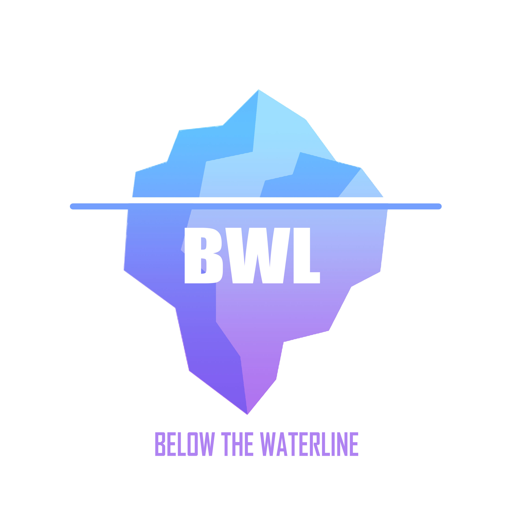

# Puntos-Semanales-BWL

> Solos se llega más rápido pero en equipo se llega más lejos

En este repositorio se va a manejar todo lo referente a los puntajes de los integrantes del grupo de BWL (Below The Water Line). Estos puntajes se obtienen por los challenges y el cumplimiento de las responsabilidades del equipo.

---
## :fire: Puntos del Equipo: 0 pts
---

## Puntos Individuales:

| Nombre | :smile: Puntos |  |
|---|---|---|
| Gianni | 0 pts| :house: Admin Sala BWL
| Rosana | 0 pts| :dollar: Coord. Finanzas
| Mafer | 0 pts| :mega: Relaciones Públicas
| Juan Diego | 0 pts | :chart_with_upwards_trend: Coord. Proyectos
| Jonathan | 0 pts| :orange_book: Coord. Educación
| Fabio | 0 pts| :computer: Admin Sala 015
| Jesús | 0 pts| :satellite: Tecnología y Telecom

---
## Proyectos de la Semana

| Nombre | Puntos | Temas | Link | Quién terminó |
|---|---|---|---|---|
| Git and Readme Challenge | 5 | Git, Markdown | [click aquí](https://github.com/BWLTeam/git-and-readme-challenge) | @MaferMazu |
|NombreEjemplo|Puntos|Tema|[url](url)|...|

## Twitter Points
Por hacer al menos un tweet en el día correspondiente se le otorgará 1 punto.

| Día | Creador |
| --- | --- |
Lunes | Mafer
Martes | Fabio
Miércoles | Juan
Jueves | Jonathan
Viernes | Jesús
Sábado | Rosanna
Domingo | Gia 